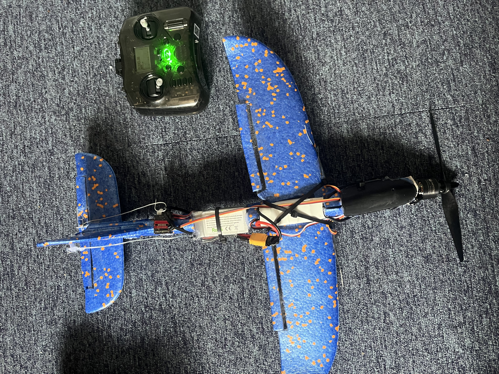

# Fixed-Wing Aircraft Design & Aerodynamic Analysis
**0.75m Span UAV | OpenVSP & VSPAERO Analysis | Fusion 360 Integration**

---

### 1. Aerodynamic Modeling & Analysis
* **Geometry & Wing Planform:** Designed and modelled three 0.75m span iterations in OpenVSP using a NACA 0006 airfoil (AR 6.1, 0.60 taper ratio) to *approximate an elliptical lift distribution and minimise induced drag*.
* **VLM Cruise Sweep:** Ran VSPAERO VLM baseline sweep at 20m/s *to hit target cruise $C_L = 0.475$, implementing a +3° wing incidence to eliminate nose-up fuselage attitude and reduce parasitic cruise drag*.
* **Trim & Stability Analysis:** Executed trim analysis to evaluate lift, drag, pitching moments, and stability across 10 angles of attack. Calculated CoG placement via VLM results *to guarantee a 10–15% static margin*.
* **Flow Verification:** Analysed generated graphs to verify pressure and wake distributions, ensuring no premature tip stalls occurred

---

### 2. Detailed CAD & Physical Prototyping
* **Internal Structural Design:** Modelled full assembly in Autodesk Fusion including *internal electronics bays, servo nests, energy-absorbing elastic wing mounts, and internal wing structure* to ensure simplicity during manufacturing.
* **BOM & Prototyping:** Delivered a complete Bill of Materials (BOM) total: **£90**. Built original proof-of-concept prototype using a pre-made fixed-wing glider frame; current iteration is actively undergoing full-scale 3D printing.

---

### 3. Project Figures & Documentation

| Figure 1 | Figure 2 |
| :---: | :---: |
| **Figure 1:** OpenVSP Geometry & Wing Planform Layout | **Figure 2:** VSPAERO Vortex Lattice Method (VLM) Mesh |
|  |  |

| Figure 3 | Figure 4 |
| :---: | :---: |
| **Figure 3:** Lift Distribution curve | **Figure 4:** Pressure Gradients |
|  |  |

| Figure 5 | Figure 6 |
| :---: | :---: |
| **Figure 5:** Original Fusion 360 iteration with internal Bay & Servo Layout | **Figure 6:** Second Fusion 360 iteration with Elastic Wing Mount  |
|  |  |

| Figure 7 | 
| :---: |
| **Figure 7:** Original prototype | 
|  | 

---

## 4. Payload & Avionics Integration

* **Sledge Architecture:** Designed a 1-piece, 3D-printed PETG sledge ($135\text{mm} \times 38.5\text{mm}$) rated to $75^\circ\text{C}$ glass transition temperature to prevent structural deformation under battery loads.
* **Structural Tie-Rods:** Suspended between two $42\text{mm}$ diameter birch plywood bulkheads using dual $3\text{mm}$ stainless steel threaded rods to handle high tension during parachute deployment.
* **Vibration & Recovery:** Secured with Nyloc hex nuts and shoulder washers to dampen flight vibrations, featuring a central threaded eyebolt for recovery rigging.
* **Material selection:** 3D printed our sledge out of PETG due its heat resistance properties, retaining its structural stability up to 75 degrees celsius, ensuring it won’t warp or deform under the weight of the battery and other avionics components whilst giving us the freedom to design a precise optimised geometry, unlike if we constructed one out of multiple bodies. The rods will be made out of stainless steel due to its high UTS. As the material would perform well under the high tension it will experience during parachute deployment whilst meeting the other requirements. We chose plywood for the bulkheads as it is cheap and lightweight, whilst good at handling compression from the airframe. Nyloc nuts were also specifically chosen due to their ability to cope with the high vibrations normal nuts cannot.
* **Optimising :** Worked closely with the structures team to ensure bay was correct dimensions, weight and was recoverable and with the avionics team to allow optimal placing of components, taking into account positions of wires and more.

| Avionics CAD Render | Physical Assembly / Fit Check |
| :---: | :---: |
| **Figure 9:** PETG Sledge & Rod Integration | **Figure 10:** Bulkhead & Nyloc Assembly |
|  |  |

